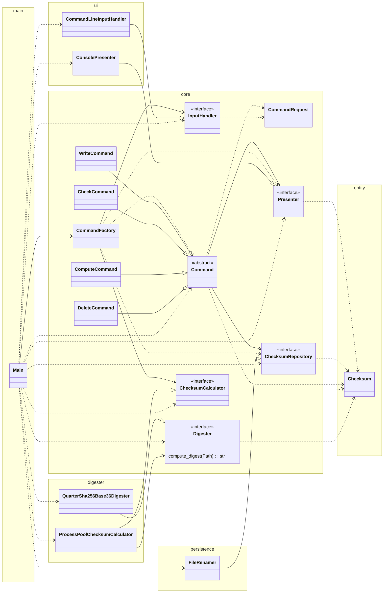
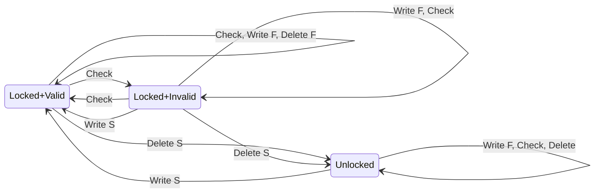

```mermaid
classDiagram
  direction LR
  namespace entity {
    class Checksum
  }
  namespace core {
    class CommandFactory {
    }
    class Command {
      <<abstract>>       
    }
    class CommandRequest
    class ChecksumCalculator {
      <<interface>>
    }
    class InputHandler {
      <<interface>>
    }
    class Presenter {
      <<interface>>
    }
    class ChecksumRepository {
      <<interface>>
    }
    class Digester {
      <<interface>>
      compute_digest(Path): str
    }
    class CheckCommand
    class ComputeCommand
    class WriteCommand
    class DeleteCommand
  }
  namespace digester {
    class QuarterSha256Base36Digester
    class ProcessPoolChecksumCalculator
  }
  namespace persistence {
    class FileRenamer
  }
  namespace ui {
    class ConsolePresenter
    class CommandLineInputHandler
  }
  namespace main {
    class Main
  }
  CommandFactory ..> Command
  WriteCommand --|> Command
  CheckCommand --|> Command
  ComputeCommand --|> Command
  DeleteCommand --|> Command
  Command --> Presenter
  Presenter ..> Checksum
  Command --> ChecksumRepository
  ChecksumRepository ..> Checksum
  Command ..> CommandRequest
  Command ..> Checksum
  CommandFactory --> InputHandler
  CommandFactory --> ChecksumCalculator
  CommandFactory ..> Presenter
  CommandFactory ..> ChecksumRepository
  InputHandler ..> CommandRequest
  ProcessPoolChecksumCalculator --|> ChecksumCalculator
  ChecksumCalculator ..> Checksum
  ConsolePresenter --|> Presenter
  CommandLineInputHandler --|> InputHandler
  QuarterSha256Base36Digester --|> Digester
  Digester ..> Checksum
  FileRenamer --|> ChecksumRepository
  Main ..> Command
  Main ..> InputHandler
  Main --> CommandFactory
  Main ..> ChecksumRepository
  Main ..> Digester
  Main ..> Presenter
  Main ..> ChecksumCalculator
  Main ..> CommandLineInputHandler
  Main ..> ConsolePresenter
  Main ..> QuarterSha256Base36Digester
  Main ..> FileRenamer
  Main ..> ProcessPoolChecksumCalculator
  ProcessPoolChecksumCalculator --> Digester
```

```mermaid
stateDiagram
  direction LR

  Locked+Valid --> Locked+Valid : Check, Write F, Delete F
  Locked+Valid --> Locked+Invalid : Check
  Locked+Invalid --> Locked+Valid: Check
  Locked+Invalid --> Locked+Valid : Write S
  Locked+Invalid --> Locked+Invalid : Write F, Check
  Unlocked --> Locked+Valid : Write S
  Unlocked --> Unlocked : Write F, Check, Delete
  Locked+Valid --> Unlocked : Delete S 
  Locked+Invalid --> Unlocked : Delete S 
```

