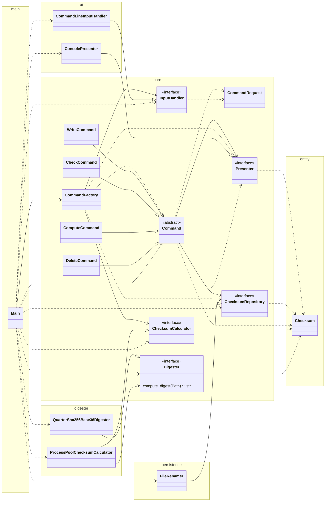
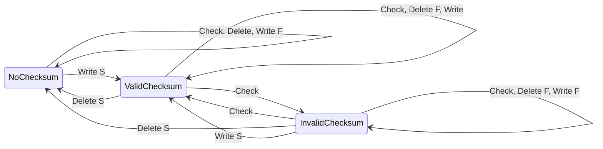

```mermaid
classDiagram
    direction LR
    namespace entity {
      class Checksum
    }
    namespace core {
      class CommandFactory {
      }
      class Command {
        <<abstract>>       
      }
      class CommandRequest
      class ChecksumCalculator {
        <<interface>>
      }
      class InputHandler {
        <<interface>>
      }
      class Presenter {
        <<interface>>
      }
      class ChecksumRepository {
        <<interface>>
      }
      class Digester {
        <<interface>>
        compute_digest(Path): str
      }
      class CheckCommand
      class ComputeCommand
      class WriteCommand
      class DeleteCommand
    }
    namespace digester {
      class QuarterSha256Base36Digester
      class ProcessPoolChecksumCalculator
    }
    namespace persistence {
      class FileRenamer
    }
    namespace ui {
      class ConsolePresenter
      class CommandLineInputHandler
    }
    namespace main {
      class Main
    }
    CommandFactory ..> Command
    WriteCommand --|> Command
    CheckCommand --|> Command
    ComputeCommand --|> Command
    DeleteCommand --|> Command
    Command --> Presenter
    Presenter ..> Checksum
    Command --> ChecksumRepository
    ChecksumRepository ..> Checksum
    Command ..> CommandRequest
    Command ..> Checksum
    CommandFactory --> InputHandler
    CommandFactory --> ChecksumCalculator
    CommandFactory ..> Presenter
    CommandFactory ..> ChecksumRepository
    InputHandler ..> CommandRequest
    ProcessPoolChecksumCalculator --|> ChecksumCalculator
    ChecksumCalculator ..> Checksum
    ConsolePresenter --|> Presenter
    CommandLineInputHandler --|> InputHandler
    QuarterSha256Base36Digester --|> Digester
    Digester ..> Checksum
    FileRenamer --|> ChecksumRepository
    Main ..> Command
    Main ..> InputHandler
    Main --> CommandFactory
    Main ..> ChecksumRepository
    Main ..> Digester
    Main ..> Presenter
    Main ..> ChecksumCalculator
    Main ..> CommandLineInputHandler
    Main ..> ConsolePresenter
    Main ..> QuarterSha256Base36Digester
    Main ..> FileRenamer
    Main ..> ProcessPoolChecksumCalculator
    ProcessPoolChecksumCalculator --> Digester
```

```mermaid
stateDiagram
  direction LR

  NoChecksum --> NoChecksum : Check, Delete, Write F
  NoChecksum --> ValidChecksum : Write S
  ValidChecksum --> NoChecksum : Delete S
  ValidChecksum --> ValidChecksum : Check, Delete F, Write
  ValidChecksum --> InvalidChecksum : Check
  InvalidChecksum --> ValidChecksum : Check
  InvalidChecksum --> NoChecksum : Delete S
  InvalidChecksum --> InvalidChecksum : Check, Delete F, Write F
  InvalidChecksum --> ValidChecksum : Write S
```
